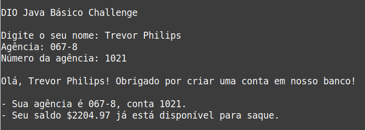

# DIO Java Básico

 

## Descrição

Desafio de projeto que consiste em simular a criação de uma conta bancária por meio de uma aplicação console utilizando entrada e saída de dados com a linguagem Java.



## Instalação e Uso

1. Faça o download dos arquivos desse repositório e navege para a pasta `BankAccount` usando o terminal
2. Execute o arquivo `BankAccount/bin/App.class`
3. (Alternativa) Se desejar executar o projeto em uma IDE, abra o projeto `BankAccount` na sua IDE preferida e execute-o a partir de lá.

```bash
cd BankAccount
java -cp bin App
```

> Nota: É necessário ter o **JDK** ou **JRE** instalado para rodar a aplicação.
